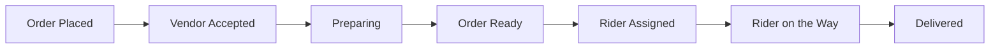

# 🍕 Doorstep - Food Delivery Platform

> Your favorite food, delivered right to your doorstep.

Doorstep is a modern, full-featured food delivery platform built with Next.js 15, Firebase, and AI capabilities. It provides a seamless experience for customers ordering food, vendors managing their restaurants, riders delivering orders, and administrators overseeing the entire operation.

[](https://nextjs.org/)
[](https://firebase.google.com/)
[](https://www.typescriptlang.org/)
[](https://tailwindcss.com/)

## 🌟 Key Features

### For Customers
- **Browse Menu**: View available restaurants and food items before logging in
- **Real-Time Order Tracking**: Track orders from placement to delivery with live status updates
- **Secure Payments**: Integrated with Paystack for safe and reliable transactions
- **Order History**: View past orders and reorder favorites
- **PWA Support**: Install as a Progressive Web App for a native-like experience

### For Vendors/Restaurants
- **Restaurant Management**: Create and manage restaurant profiles
- **Menu Management**: Add, edit, and remove food items with descriptions and prices
- **Order Management**: Accept and manage incoming orders
- **Real-Time Updates**: Receive instant notifications for new orders
- **Bank Details**: Update payout information for receiving payments
- **Analytics**: View performance metrics and order statistics

### For Riders
- **Order Queue**: View available delivery orders
- **Route Optimization**: Integrated with Google Maps for efficient delivery routes
- **Status Updates**: Update order status in real-time
- **Earnings Tracking**: Monitor delivery earnings and history

### For Administrators
- **Analytics Dashboard**: Comprehensive insights including:
  - Top performing restaurants
  - Most popular items
  - Most active customers
  - Revenue metrics
- **User Management**: Oversee all users across the platform
- **Platform Oversight**: Monitor and manage the entire operation

## 🛠️ Technology Stack

### Frontend
- **Next.js 15.5.4** - React framework with App Router
- **React 18** - UI library
- **TypeScript** - Type-safe development
- **Tailwind CSS** - Utility-first CSS framework
- **shadcn/ui** - Beautiful, accessible UI components
- **Radix UI** - Headless UI component library
- **Framer Motion** - Animation library
- **Zustand** - State management

### Backend & Services
- **Firebase 11.9.1** - Backend as a Service
  - Authentication
  - Firestore Database
  - Cloud Storage
  - Hosting
- **Genkit AI** - AI-powered features with Google AI
- **Paystack** - Payment processing
- **Google Maps API** - Location services and routing

### Development Tools
- **Turbopack** - Fast development server
- **ESLint** - Code linting
- **PostCSS** - CSS processing
- **PWA** - Progressive Web App support

## 🚀 Getting Started

### Prerequisites
- Node.js 20 or higher
- npm or yarn
- Firebase project
- Paystack account
- Google Maps API key

### Installation

1. **Clone the repository**
   ```bash
   git clone https://github.com/theahmadm3/doorstep-prototype.git
   cd doorstep-prototype
   ```

2. **Install dependencies**
   ```bash
   npm install
   ```

3. **Set up environment variables**
   Create a `.env.local` file in the root directory with the following:
   ```env
   # Firebase Configuration
   NEXT_PUBLIC_FIREBASE_API_KEY=your_api_key
   NEXT_PUBLIC_FIREBASE_AUTH_DOMAIN=your_auth_domain
   NEXT_PUBLIC_FIREBASE_PROJECT_ID=your_project_id
   NEXT_PUBLIC_FIREBASE_STORAGE_BUCKET=your_storage_bucket
   NEXT_PUBLIC_FIREBASE_MESSAGING_SENDER_ID=your_sender_id
   NEXT_PUBLIC_FIREBASE_APP_ID=your_app_id
   
   # Paystack Configuration
   NEXT_PUBLIC_PAYSTACK_PUBLIC_KEY=your_paystack_public_key
   
   # Google Maps API
   NEXT_PUBLIC_GOOGLE_MAPS_API_KEY=your_google_maps_key
   
   # Google AI (Genkit)
   GOOGLE_GENAI_API_KEY=your_google_ai_key
   ```

4. **Run the development server**
   ```bash
   npm run dev
   ```

5. **Open your browser**
   Navigate to [http://localhost:9002](http://localhost:9002)

## 📁 Project Structure

```
doorstep-prototype/
├── src/
│   ├── app/                    # Next.js App Router pages
│   │   ├── admin/             # Admin dashboard pages
│   │   ├── customer/          # Customer-facing pages
│   │   ├── vendor/            # Vendor/restaurant pages
│   │   ├── rider/             # Rider delivery pages
│   │   ├── menu/              # Public menu browsing
│   │   ├── login/             # Authentication pages
│   │   ├── signup/            # User registration
│   │   └── api/               # API routes
│   ├── components/            # React components
│   │   ├── ui/                # shadcn/ui components
│   │   ├── layout/            # Layout components
│   │   ├── auth/              # Authentication components
│   │   ├── dashboard/         # Dashboard components
│   │   └── ...
│   ├── hooks/                 # Custom React hooks
│   ├── lib/                   # Utility functions
│   ├── stores/                # Zustand state stores
│   │   ├── useAuthStore.ts    # Authentication state
│   │   ├── useCartStore.ts    # Shopping cart state
│   │   └── useUIStore.ts      # UI state
│   └── ai/                    # AI/Genkit configuration
├── public/                    # Static assets
│   ├── doorstep-logo.png     # App logo
│   ├── manifest.json          # PWA manifest
│   └── ...
├── docs/                      # Documentation
│   └── blueprint.md           # Project blueprint
└── ...
```

## 📜 Available Scripts

- `npm run dev` - Start development server on port 9002 with Turbopack
- `npm run build` - Build production bundle
- `npm run start` - Start production server
- `npm run lint` - Run ESLint
- `npm run typecheck` - Type check with TypeScript
- `npm run genkit:dev` - Start Genkit AI development server
- `npm run genkit:watch` - Start Genkit with watch mode

## 🎨 Design System

### Color Palette
- **Primary**: `#343D46` - Main brand color (dark gray-blue)
- **Background**: `#F3F3F3` - Light neutral background
- **Accent**: `#005582` - Call-to-action color (deep blue)
- **Theme**: `#005380` - Theme/status bar color

### Typography
- **Primary Font**: Inter - Clean, modern sans-serif
- **Headline Font**: Poppins - Bold, attention-grabbing

### Design Principles
- Clean and modern layout showcasing food imagery
- Responsive design with mobile-first approach
- Subtle animations for smooth user experience
- Slide-out menu for screens under 700px
- Accessibility-first with Radix UI primitives

## 🔄 Order Flow



## 🔐 User Types & Authentication

The platform supports four distinct user roles:
1. **Customer** - Browse and order food
2. **Vendor** - Manage restaurants and menus
3. **Rider** - Deliver orders
4. **Admin** - Oversee platform operations

Each role has a dedicated interface and separate sign-up flow, with a unified login system.

## 📱 Progressive Web App (PWA)

Doorstep is a fully-featured PWA with:
- Offline support
- Install prompts for mobile and desktop
- Push notifications
- Home screen installation
- App-like experience

## 🚀 Deployment

### Firebase App Hosting

The project is configured for Firebase App Hosting:

```bash
# Build and deploy
npm run build
firebase deploy
```

Configuration is managed in `apphosting.yaml`.

## 🤝 Contributing

This is a prototype/development repository. For contributions:

1. Fork the repository
2. Create a feature branch (`git checkout -b feature/amazing-feature`)
3. Commit your changes (`git commit -m 'Add some amazing feature'`)
4. Push to the branch (`git push origin feature/amazing-feature`)
5. Open a Pull Request

## 📄 License

This project is currently a prototype. License information to be determined.

## 👥 Developer Guide

### Creating the Landing Page

This README serves as a guide for developers to create a proper landing page. Key elements to include:

1. **Hero Section**
   - Compelling headline emphasizing food delivery convenience
   - High-quality food imagery
   - Clear call-to-action buttons (Order Now, Become a Vendor)
   
2. **Features Section**
   - Highlight key differentiators (wide selection, fast delivery, real-time tracking)
   - Use icons from lucide-react library
   - Keep descriptions concise and benefit-focused
   
3. **How It Works**
   - Simple 3-step process (Browse & Select, Checkout, Track & Enjoy)
   - Visual step indicators
   - Clear, actionable language
   
4. **Trust Indicators**
   - Payment security badges
   - Delivery guarantee
   - Customer testimonials (future enhancement)
   
5. **Footer**
   - Quick links to important pages
   - Contact information
   - Social media links
   - Legal pages (Terms, Privacy)

### Best Practices

- **Performance**: Optimize images, lazy load components
- **SEO**: Use proper meta tags, semantic HTML
- **Accessibility**: ARIA labels, keyboard navigation, screen reader support
- **Mobile First**: Design for mobile, enhance for desktop
- **Testing**: Test all user flows across different devices and browsers

## 📞 Support

For questions or support, please refer to the documentation in the `/docs` folder or contact the development team.

---

**Built with ❤️ for food lovers everywhere**
